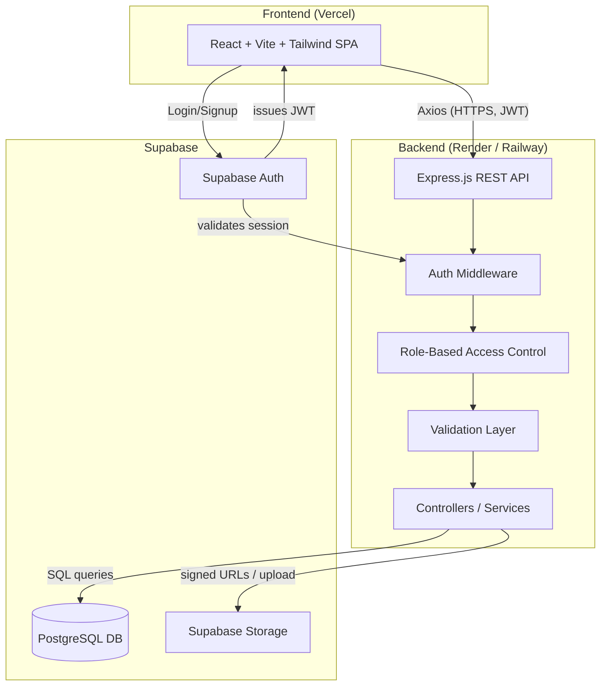

# PaintAfrica — System Architecture

## 1. High-Level Architecture



**Why this shape:**
- **Frontend never talks to Postgres directly** — all data access goes through the
  Express API, so business logic, validation, and RBAC live in one place.
- **Supabase Auth** issues JWTs the frontend attaches to every API request; the
  Express backend verifies them (via Supabase's JWT secret) rather than rolling our
  own auth — less security surface to get wrong.
- **Supabase Storage** handles file uploads (design files, portfolio images) — the
  backend generates signed upload URLs so large files don't have to pass through
  our Express server.

## 2. Component Responsibilities

| Layer | Responsibility |
|---|---|
| React SPA | UI, client-side routing, form handling, calling API via Axios |
| Express API | Business logic, validation, RBAC, orchestration between DB & Storage |
| PostgreSQL (Supabase) | Source of truth for all structured data |
| Supabase Auth | Identity, password hashing, session/JWT issuance |
| Supabase Storage | Design files, order attachments, portfolio images, business logos |

## 3. Backend Folder Structure

```
paintafrica-backend/
├── src/
│   ├── config/
│   │   ├── db.js                # Postgres/Supabase client init
│   │   └── env.js               # env var loading & validation
│   ├── middleware/
│   │   ├── auth.middleware.js   # verifies Supabase JWT
│   │   ├── role.middleware.js   # RBAC guard (customer/business/designer/admin)
│   │   ├── error.middleware.js  # centralized error handler
│   │   └── validate.middleware.js
│   ├── modules/
│   │   ├── users/
│   │   │   ├── user.routes.js
│   │   │   ├── user.controller.js
│   │   │   ├── user.service.js
│   │   │   └── user.schema.js   # Zod/Joi validation schemas
│   │   ├── businesses/
│   │   ├── designers/
│   │   ├── services/
│   │   ├── orders/
│   │   ├── messages/
│   │   ├── files/
│   │   └── reviews/
│   ├── utils/
│   │   ├── logger.js
│   │   └── apiResponse.js
│   ├── app.js                   # express app + middleware wiring
│   └── server.js                # entrypoint
├── tests/
│   ├── unit/
│   └── integration/
├── .env.example
├── package.json
└── README.md
```

## 4. Frontend Folder Structure

```
paintafrica-frontend/
├── src/
│   ├── api/
│   │   ├── axiosClient.js
│   │   └── endpoints/            # orders.api.js, services.api.js, etc.
│   ├── auth/
│   │   ├── AuthContext.jsx
│   │   └── ProtectedRoute.jsx
│   ├── components/
│   │   ├── common/                # Button, Input, Modal, Badge...
│   │   └── layout/                 # Navbar, Sidebar, Footer
│   ├── pages/
│   │   ├── customer/               # Home, Catalog, OrderForm, MyOrders
│   │   ├── business/                # Dashboard, Orders, Services
│   │   ├── designer/                # Portfolio, Requests
│   │   └── admin/                   # UserManagement, Analytics
│   ├── hooks/
│   ├── routes/
│   │   └── AppRoutes.jsx
│   ├── App.jsx
│   └── main.jsx
├── .env.example
├── tailwind.config.js
├── vite.config.js
└── package.json
```

## 5. API Design (Phase 2 — endpoint contract)

Base URL: `/api/v1`

### Auth
| Method | Endpoint | Access | Description |
|---|---|---|---|
| POST | `/auth/register` | Public | Create account (role: customer/business/designer) |
| POST | `/auth/login` | Public | Login, returns JWT |
| POST | `/auth/logout` | Authenticated | Invalidate session |
| GET | `/auth/me` | Authenticated | Current user profile |

### Services (catalog)
| Method | Endpoint | Access | Description |
|---|---|---|---|
| GET | `/services` | Public | List/search/filter services |
| GET | `/services/:id` | Public | Service detail |
| POST | `/services` | Business/Designer | Create a listing |
| PUT | `/services/:id` | Owner | Update listing |
| DELETE | `/services/:id` | Owner/Admin | Remove listing |

### Orders
| Method | Endpoint | Access | Description |
|---|---|---|---|
| POST | `/orders` | Customer | Create order (with file refs) |
| GET | `/orders` | Authenticated | List own orders (scoped by role) |
| GET | `/orders/:id` | Owner/Business/Admin | Order detail |
| PATCH | `/orders/:id/status` | Business/Designer | Update order status |
| PATCH | `/orders/:id/quote` | Business/Designer | Submit a quote (sets `quoted_amount`, status → `quoted`) |
| PATCH | `/orders/:id/accept` | Customer | Confirm quote, status → `accepted` |
| PATCH | `/orders/:id/reject` | Business/Designer/Customer | Reject/decline order |
| PATCH | `/orders/:id/payment` | Business/Designer | Manually mark order payment as `paid` (offline) |

### Files
| Method | Endpoint | Access | Description |
|---|---|---|---|
| POST | `/files/upload-url` | Authenticated | Get signed Supabase Storage upload URL |
| POST | `/files` | Authenticated | Register uploaded file metadata against an order |

### Messages
| Method | Endpoint | Access | Description |
|---|---|---|---|
| GET | `/orders/:id/messages` | Order participants | Thread for an order |
| POST | `/orders/:id/messages` | Order participants | Send message |

### Reviews
| Method | Endpoint | Access | Description |
|---|---|---|---|
| POST | `/orders/:id/review` | Customer | Leave review after completion |
| GET | `/businesses/:id/reviews` | Public | List reviews for a business |

### Admin
| Method | Endpoint | Access | Description |
|---|---|---|---|
| GET | `/admin/users` | Admin | List/manage users |
| PATCH | `/admin/businesses/:id/approve` | Admin | Approve business |
| GET | `/admin/orders` | Admin | Platform-wide order view |
| GET | `/admin/analytics` | Admin | Basic metrics |

All list endpoints support `?page=&limit=` pagination. All mutating endpoints
validate input via schema (Zod/Joi) before hitting the service layer.

## 6. Security Practices (baked in from day one)

- JWT verification on every protected route (Supabase JWT secret)
- Role-based middleware guarding role-specific routes
- Input validation on every write endpoint
- Parameterized queries only (no string-concatenated SQL) — via Supabase client or a query builder
- File upload restrictions: allowed MIME types + max size enforced server-side
- CORS locked to known frontend origin(s)
- Environment variables for all secrets (never committed — `.env` in `.gitignore`)
- Rate limiting on auth endpoints (brute-force protection)
- Row-Level Security (RLS) policies enabled in Supabase as a second layer of defense
