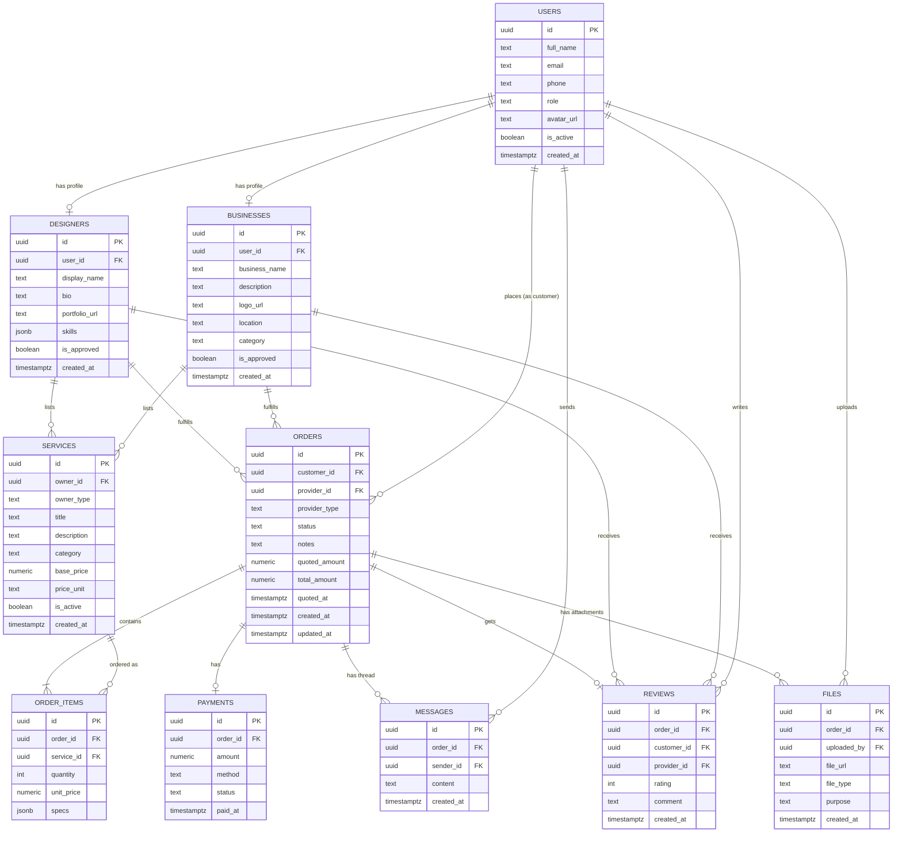

# PaintAfrica — Database ERD & Schema

## 1. Entity-Relationship Diagram



## 2. Design Notes

- **`businesses`/`designers` reference `users` 1:1** — a single `users` table
  holds identity/auth data; role-specific profile tables hold role-specific
  fields. This avoids a giant sparse `users` table with nullable columns for
  every role.
- **`services.owner_id` + `owner_type`** — a service can belong to either a
  business or a designer, so we use a polymorphic reference
  (`owner_type = 'business' | 'designer'`) instead of two nullable FKs.
  Enforced at the application layer + a CHECK constraint.
- **`orders.provider_id` + `provider_type`** — same polymorphic pattern,
  since an order can be fulfilled by a business or a designer.
- **`order_items`** lets one order contain multiple services/quantities
  (e.g. "500 flyers + 100 business cards" in a single order).
- **`files`** are linked to an order (not directly to a service) so both the
  customer's original design/brief and the provider's completed deliverable
  live in the same place, distinguished by `purpose` (`'brief'` vs
  `'deliverable'`).
- **`payments`** is a separate table (not columns on `orders`) so it's ready
  to extend later without touching the orders table — MVP payments are
  offline (cash/mobile money on pickup); the business marks `status = 'paid'`
  manually once received.
- **`orders.quoted_amount` / `quoted_at`** support the quote-based pricing
  model: the customer submits specs, the business/designer reviews and sends
  back a quote (`status: 'pending' → 'quoted'`), and the customer then
  confirms to move it to `'accepted'`. `services.base_price` becomes an
  *estimate/starting price* shown in the catalog, not a locked price.

## 3. SQL Migration (Postgres / Supabase)

```sql
-- Enable UUID generation
create extension if not exists "pgcrypto";

create table users (
    id uuid primary key default gen_random_uuid(),
    full_name text not null,
    email text not null unique,
    phone text,
    role text not null check (role in ('customer','business','designer','admin')),
    avatar_url text,
    is_active boolean not null default true,
    created_at timestamptz not null default now()
);

create table businesses (
    id uuid primary key default gen_random_uuid(),
    user_id uuid not null unique references users(id) on delete cascade,
    business_name text not null,
    description text,
    logo_url text,
    location text,
    category text,
    is_approved boolean not null default false,
    created_at timestamptz not null default now()
);

create table designers (
    id uuid primary key default gen_random_uuid(),
    user_id uuid not null unique references users(id) on delete cascade,
    display_name text not null,
    bio text,
    portfolio_url text,
    skills jsonb default '[]',
    is_approved boolean not null default false,
    created_at timestamptz not null default now()
);

create table services (
    id uuid primary key default gen_random_uuid(),
    owner_id uuid not null,
    owner_type text not null check (owner_type in ('business','designer')),
    title text not null,
    description text,
    category text not null,
    base_price numeric(12,2) not null check (base_price >= 0),
    price_unit text default 'flat',
    is_active boolean not null default true,
    created_at timestamptz not null default now()
);
create index idx_services_owner on services(owner_id, owner_type);
create index idx_services_category on services(category);

create table orders (
    id uuid primary key default gen_random_uuid(),
    customer_id uuid not null references users(id),
    provider_id uuid not null,
    provider_type text not null check (provider_type in ('business','designer')),
    status text not null default 'pending'
        check (status in ('pending','quoted','accepted','rejected','in_production','ready','completed','cancelled')),
    notes text,
    quoted_amount numeric(12,2),
    quoted_at timestamptz,
    total_amount numeric(12,2) default 0,
    created_at timestamptz not null default now(),
    updated_at timestamptz not null default now()
);
create index idx_orders_customer on orders(customer_id);
create index idx_orders_provider on orders(provider_id, provider_type);
create index idx_orders_status on orders(status);

create table order_items (
    id uuid primary key default gen_random_uuid(),
    order_id uuid not null references orders(id) on delete cascade,
    service_id uuid not null references services(id),
    quantity int not null check (quantity > 0),
    unit_price numeric(12,2) not null,
    specs jsonb default '{}'
);
create index idx_order_items_order on order_items(order_id);

create table payments (
    id uuid primary key default gen_random_uuid(),
    order_id uuid not null unique references orders(id) on delete cascade,
    amount numeric(12,2) not null,
    method text default 'offline' check (method in ('offline','mobile_money','card')),
    status text not null default 'pending' check (status in ('pending','paid','failed')),
    paid_at timestamptz
);

create table messages (
    id uuid primary key default gen_random_uuid(),
    order_id uuid not null references orders(id) on delete cascade,
    sender_id uuid not null references users(id),
    content text not null,
    created_at timestamptz not null default now()
);
create index idx_messages_order on messages(order_id);

create table files (
    id uuid primary key default gen_random_uuid(),
    order_id uuid references orders(id) on delete cascade,
    uploaded_by uuid not null references users(id),
    file_url text not null,
    file_type text,
    purpose text check (purpose in ('brief','deliverable','portfolio','logo')),
    created_at timestamptz not null default now()
);
create index idx_files_order on files(order_id);

create table reviews (
    id uuid primary key default gen_random_uuid(),
    order_id uuid not null unique references orders(id) on delete cascade,
    customer_id uuid not null references users(id),
    provider_id uuid not null,
    rating int not null check (rating between 1 and 5),
    comment text,
    created_at timestamptz not null default now()
);
create index idx_reviews_provider on reviews(provider_id);
```

## 4. Row-Level Security (Supabase) — starting policies

```sql
alter table orders enable row level security;

create policy "customers see own orders"
  on orders for select
  using (auth.uid() = customer_id);

create policy "providers see their orders"
  on orders for select
  using (auth.uid() in (
    select user_id from businesses where id = provider_id
    union
    select user_id from designers where id = provider_id
  ));
```
*(Full RLS policy set to be completed during Phase 3 backend work — this is a
starting example, not exhaustive.)*
